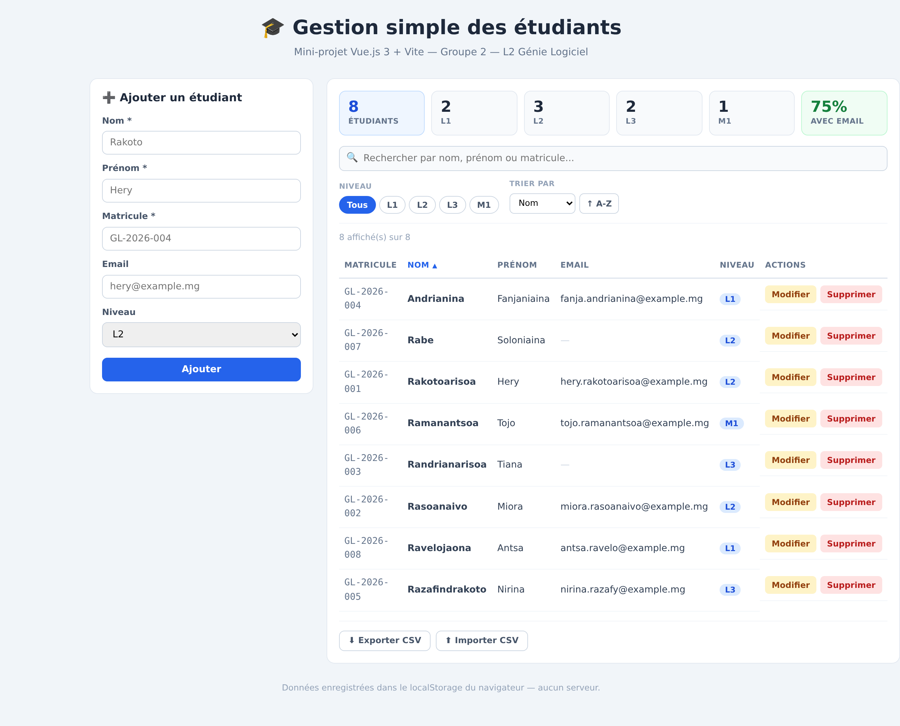
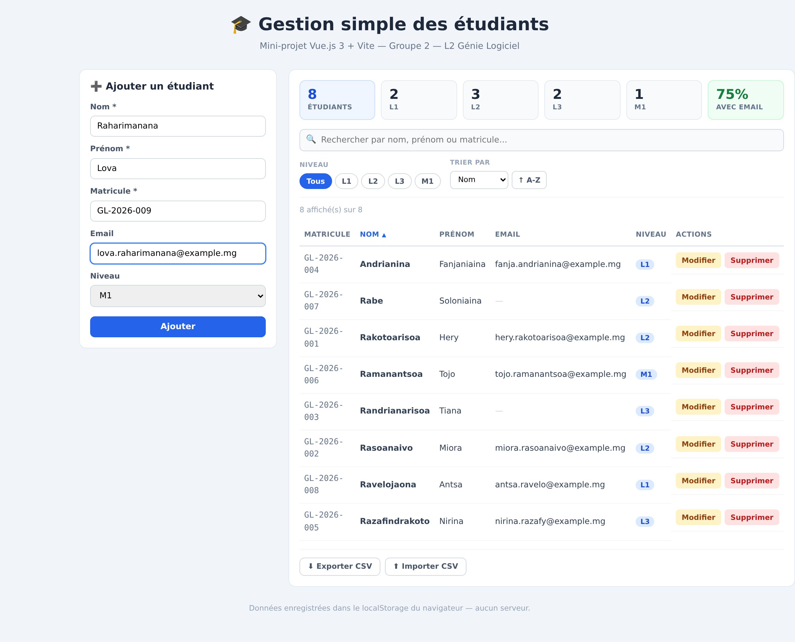
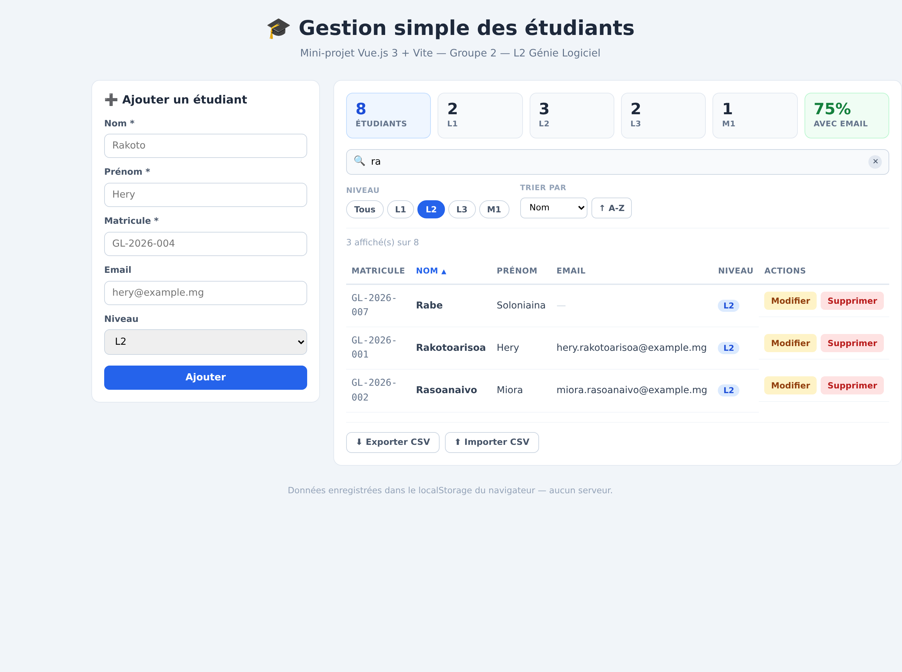

# 🎓 Gestion simple des étudiants

> Mini-projet — **Introduction aux frameworks JavaScript**
> Licence 2 — Génie Informatique / Génie Logiciel — Année 2026
> **Groupe 2**

Application web permettant de gérer une liste d'étudiants : ajout, modification,
suppression et recherche. Réalisée avec **Vue.js 3** et **Vite**.

---

## 👥 Membres du groupe (13)

| # | Nom et prénom | GitHub | Pôle | Fichier(s) dont il est responsable | Commits |
|---|---------------|--------|------|------------------------------------|---------|
| 1 | *À REMPLIR* | `@...` | 1 — Noyau | `src/composables/useEtudiants.js` | — |
| 2 | *À REMPLIR* | `@...` | 1 — Noyau | `src/App.vue` | — |
| 3 | *À REMPLIR* | `@...` | 2 — Formulaire | `src/components/FormulaireEtudiant.vue` | — |
| 4 | *À REMPLIR* | `@...` | 2 — Formulaire | `src/utils/validation.js` | — |
| 5 | *À REMPLIR* | `@...` | 3 — Tableau | `src/components/ListeEtudiants.vue` | — |
| 6 | *À REMPLIR* | `@...` | 3 — Tableau | `src/components/LigneEtudiant.vue` | — |
| 7 | *À REMPLIR* | `@...` | 4 — Recherche | `src/components/BarreRecherche.vue` | — |
| 8 | *À REMPLIR* | `@...` | 4 — Recherche | `src/components/FiltresEtudiants.vue` | — |
| 9 | *À REMPLIR* | `@...` | 5 — Stats | `src/components/StatistiquesEtudiants.vue` | — |
| 10 | *À REMPLIR* | `@...` | 5 — Stats | `src/components/ModaleConfirmation.vue` | — |
| 11 | *À REMPLIR* | `@...` | 6 — Outils | `src/components/ImportExport.vue` | — |
| 12 | *À REMPLIR* | `@...` | 6 — Design | `src/style.css` | — |
| 13 | *À REMPLIR* | `@...` | 6 — Doc | `README.md`, `captures/` | — |

### Preuve objective des contributions

Sortie de `git shortlog -sn --no-merges` (à coller ici avant le rendu) :

```text
    12  Prénom Nom
    11  Prénom Nom
    ...
```

## ✨ Fonctionnalités réalisées

- [x] **Ajouter** un étudiant (nom, prénom, matricule, email, niveau)
- [x] **Modifier** les informations d'un étudiant existant
- [x] **Supprimer** un étudiant (avec demande de confirmation)
- [x] **Rechercher** un étudiant par nom, prénom ou matricule (filtrage en direct)
- [x] **Validation** du formulaire (champs obligatoires, matricule unique, format email)
- [x] **Sauvegarde automatique** dans le `localStorage` du navigateur

### Fonctionnalités supplémentaires

- [x] **Filtre par niveau** (L1 / L2 / L3 / M1)
- [x] **Tri** par nom, prénom, matricule ou niveau (clic sur l'en-tête de colonne)
- [x] **Statistiques** : total, répartition par niveau, pourcentage avec email
- [x] **Modale de confirmation** avant suppression (`<Teleport>`)
- [x] **Export CSV** de la liste et **import CSV**
- [x] Compteur d'étudiants affichés / total
- [x] Interface responsive simple

---

## 🧩 Notions Vue.js utilisées

| Notion | Où la trouver dans le code |
|---|---|
| `ref()` | `App.vue` — `etudiants`, `recherche`, `etudiantEnEdition` |
| `reactive()` | `FormulaireEtudiant.vue` — l'objet `formulaire` |
| `computed()` | `App.vue` — `etudiantsFiltres` ; `FormulaireEtudiant.vue` — `estEnEdition` |
| `watch()` | `App.vue` — sauvegarde localStorage ; `FormulaireEtudiant.vue` — remplissage du formulaire |
| `v-model` | tous les champs du formulaire et la barre de recherche |
| `v-for` | `ListeEtudiants.vue` — boucle sur les étudiants (avec `:key`) |
| `v-if` / `v-else` | titre du formulaire, message d'erreur, liste vide, email absent |
| **props** | `etudiantAModifier`, `etudiants`, `etudiant` |
| **événements** (`emit`) | `ajouter`, `modifier`, `annuler`, `editer`, `supprimer` |
| `defineModel()` | `BarreRecherche.vue` — `v-model` entre composants |
| `defineModel('nom')` | `FiltresEtudiants.vue` — plusieurs `v-model` nommés |
| **composable** | `composables/useEtudiants.js` — logique réutilisable extraite |
| `<Teleport>` | `ModaleConfirmation.vue` — la modale est déplacée dans `<body>` |
| refs sur le DOM | `ImportExport.vue` — `ref` sur `<input type="file">` |

---

## 🏗️ Architecture des composants

```
src/
│
├── composables/useEtudiants.js   ← PÔLE 1 : logique CRUD + localStorage
├── utils/validation.js           ← PÔLE 2 : règles de validation (fonctions pures)
│
└── App.vue                       ← PÔLE 1 : assemblage + état de l'interface
    │
    ├── FormulaireEtudiant.vue    ← PÔLE 2
    │     ↓ props : etudiantAModifier, matriculesExistants
    │     ↑ emit  : ajouter, modifier, annuler
    │
    ├── StatistiquesEtudiants.vue ← PÔLE 5
    │     ↓ prop  : etudiants
    │
    ├── BarreRecherche.vue        ← PÔLE 4
    │     ↕ v-model : recherche
    │
    ├── FiltresEtudiants.vue      ← PÔLE 4
    │     ↕ v-model:niveau / v-model:tri / v-model:ordre
    │
    ├── ListeEtudiants.vue        ← PÔLE 3
    │     ↓ props : etudiants (liste filtrée), tri, ordre
    │     ↑ emit  : editer, supprimer, trier
    │     │
    │     └── LigneEtudiant.vue   ← PÔLE 3
    │           ↓ prop  : etudiant
    │           ↑ emit  : editer, supprimer
    │
    ├── ImportExport.vue          ← PÔLE 6
    │     ↓ prop  : etudiants
    │     ↑ emit  : importer
    │
    └── ModaleConfirmation.vue    ← PÔLE 5
          ↓ props : visible, titre, message
          ↑ emit  : confirmer, annuler
```

> **Principe :** les données descendent avec les **props**, les actions remontent avec les **événements**.
> Chaque fichier a **un seul responsable** → aucun conflit Git.

## 📸 Captures d'écran

> Remplacez les lignes ci-dessous par vos vraies captures (dossier `captures/`).

### Liste des étudiants


### Ajout d'un étudiant


### Recherche


---

## ⚙️ Installation et lancement

### Prérequis
- [Node.js](https://nodejs.org) version 18 ou supérieure
- npm (installé automatiquement avec Node.js)

### Étapes

```bash
# 1. Cloner le dépôt
git clone https://github.com/PSEUDO/l2-gl-2026-groupe-02-gestion-etudiants.git

# 2. Entrer dans le dossier
cd l2-gl-2026-groupe-02-gestion-etudiants

# 3. Installer les dépendances
npm install

# 4. Lancer le serveur de développement
npm run dev
```

L'application est ensuite accessible sur **http://localhost:5173**

### Autres commandes

```bash
npm run build     # générer la version de production (dossier dist/)
npm run preview   # tester la version de production
```

---

## 📁 Structure du projet

```
gestion-etudiants/
├── public/
├── src/
│   ├── components/
│   │   ├── BarreRecherche.vue
│   │   ├── FiltresEtudiants.vue
│   │   ├── FormulaireEtudiant.vue
│   │   ├── ImportExport.vue
│   │   ├── LigneEtudiant.vue
│   │   ├── ListeEtudiants.vue
│   │   ├── ModaleConfirmation.vue
│   │   └── StatistiquesEtudiants.vue
│   ├── composables/
│   │   └── useEtudiants.js
│   ├── utils/
│   │   └── validation.js
│   ├── App.vue
│   ├── main.js
│   └── style.css
├── captures/
├── index.html
├── package.json
├── vite.config.js
└── README.md
```

---

## 💾 Stockage des données

Les données sont enregistrées dans le **`localStorage`** du navigateur sous la clé
`etudiants`. Elles sont donc conservées après la fermeture de l'onglet.
Aucun backend ni base de données n'est utilisé, conformément au sujet.

Pour réinitialiser les données : ouvrir la console du navigateur (`F12`) et taper
`localStorage.clear()` puis rafraîchir la page.

---

## 🛠️ Technologies

- [Vue.js 3](https://vuejs.org/) — Composition API (`<script setup>`)
- [Vite 6](https://vite.dev/) — outil de build
- CSS natif (styles `scoped` par composant)

---

## 🌿 Organisation Git

Le travail est réparti en **6 pôles**, chacun sur sa propre branche, fusionnée dans `main`
via une **Pull Request** relue par un membre d'un autre pôle.

| Branche | Pôle |
|---|---|
| `pole-1-noyau` | Noyau & assemblage |
| `pole-2-formulaire` | Formulaire & validation |
| `pole-3-tableau` | Tableau & lignes |
| `pole-4-recherche` | Recherche, filtres & tri |
| `pole-5-stats` | Statistiques & modale |
| `pole-6-doc` | Import/export, design & documentation |

La branche `main` est protégée : aucun push direct, Pull Request obligatoire.

---

*Projet réalisé dans le cadre du cours d'introduction aux frameworks JavaScript.*
