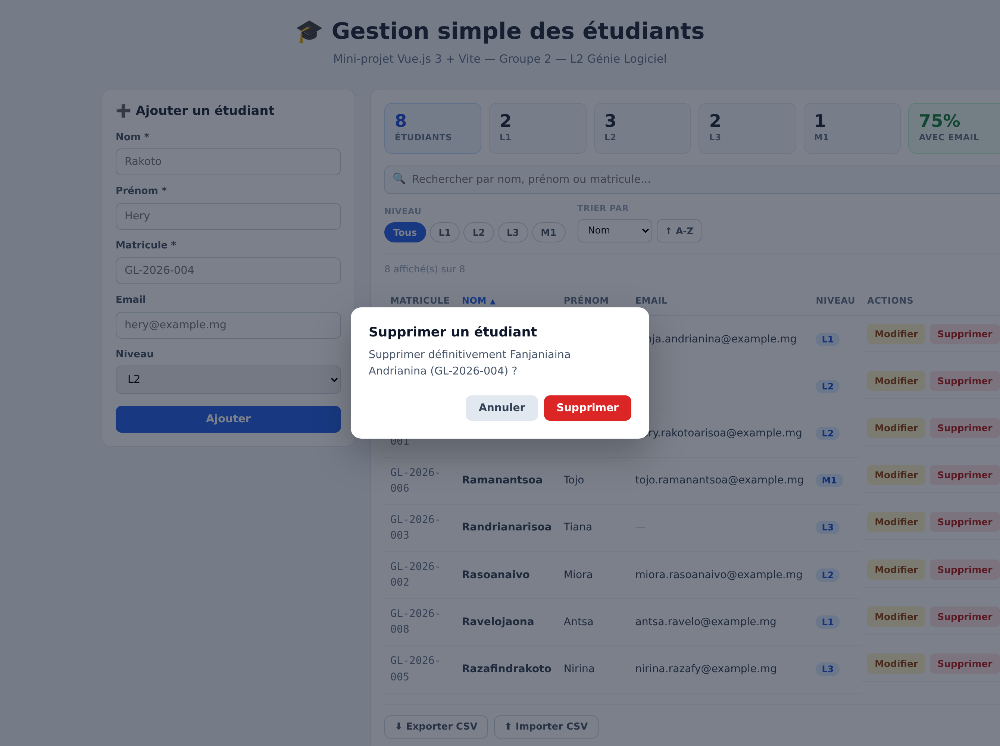

# 🎓 Gestion simple des étudiants

> Mini-projet — **Introduction aux frameworks JavaScript**
> Licence 2 — Génie Informatique / Génie Logiciel — Année 2026
> **Groupe 2**

Application web permettant de gérer une liste d'étudiants : ajout, modification,
suppression et recherche. Réalisée avec **Vue.js 3** et **Vite**, sans aucun backend.

🔗 **Dépôt :** https://github.com/rhstephano/l2-gl-2026-groupe-02-gestion-etudiants

---

## 👥 Membres du groupe (9)

| # | Nom et prénom | N° d'inscription | Compte GitHub | Fichier(s) réalisé(s) |
|---|---------------|------------------|---------------|------------------------|
| 1 | **RANDRIARIMALALA Heriniaina Stephano** *(chef de groupe)* | 13ISST24-1665FGCI/GInfo | `@rhstephano` | `useEtudiants.js`, `StatistiquesEtudiants.vue`, `ModaleConfirmation.vue`, `ImportExport.vue`, `style.css`, `captures/` |
| 2 | **RAHARIMALALA Sarobidy Veronique** | 13ISST24-1683FGCI/GInfo | `@sarobidyveronique` | `src/App.vue` |
| 3 | **CHARLES Mario Fanoina** | 13ISST24-1749FGCI/GInfo | `@charles15012006-netizen` | `src/components/FormulaireEtudiant.vue` |
| 4 | **SUSCKA Natalie** | 13ISST24-1542FGCI/GInfo | `@yaadonitch-sys` | `src/utils/validation.js` |
| 5 | **RAFAMANTANATSOA Nickas** | 13ISST24-1668FGCI/GInfo | `@nickanicka661-max` | `src/components/ListeEtudiants.vue` |
| 6 | **RAONIMBOLAHITA Fanantenana Diana** | 13ISST24-1773FGCI/GInfo | `@raonimbolahitafanantenenadiana-sys` | `src/components/LigneEtudiant.vue` |
| 7 | **DIEU DONNE Didi** | 13ISST24-1575FGCI/GInfo | `@liondidi777-star` | `src/components/BarreRecherche.vue` |
| 8 | **RAKOTOMALALA Christ Innocent** | 13ISST24-1746FGCI/GInfo | `@Innocent619` | `src/components/FiltresEtudiants.vue` |
| 9 | **LAZA TSIVERY Jean François** | 13ISST24-1750FGCI/GInfo | `@jeanfrancoishuge-lang` | `README.md` — documentation du projet |

> **Vérification des contributions.** Chaque membre a déposé son fichier **depuis son
> propre compte GitHub**. L'historique est consultable dans l'onglet **Commits** et
> le récapitulatif dans **Insights → Contributors**.

---

## 🙋 Contribution détaillée de chaque membre

### 1 · RANDRIARIMALALA Heriniaina Stephano — `@rhstephano`

**`src/composables/useEtudiants.js`**
- **Rôle :** le « cerveau » de l'application. Contient la liste des étudiants et les quatre opérations de base (ajouter, modifier, supprimer, vider), ainsi que la lecture et l'écriture dans le `localStorage`.
- **Notions Vue :** `ref()`, `watch()`, et la notion de **composable** — une fonction `useXxx()` qui regroupe une logique réutilisable en dehors de tout composant.
- **Difficulté :** les modifications d'un étudiant n'étaient pas sauvegardées. Le `watch()` ne surveillait que le remplacement du tableau entier, pas le changement d'un champ à l'intérieur. Il a fallu ajouter l'option **`{ deep: true }`**.

**`src/components/StatistiquesEtudiants.vue`**
- **Rôle :** les cartes du haut : nombre total, répartition par niveau, pourcentage d'étudiants ayant un email.
- **Notions Vue :** `computed()`, `v-for` sur un tableau de paires `[niveau, nombre]`, `v-if`, props en lecture seule.
- **Difficulté :** le pourcentage affichait `NaN%` sur une liste vide (division par zéro) ; un garde-fou `if (length === 0) return 0` corrige le problème.

**`src/components/ModaleConfirmation.vue`**
- **Rôle :** la fenêtre « Voulez-vous vraiment supprimer ? » qui remplace le `confirm()` du navigateur.
- **Notions Vue :** **`<Teleport>`**, `v-if`, props, `defineEmits`, modificateur `@click.self`.
- **Difficulté :** cliquer **dans** la fenêtre la fermait aussi, car l'événement remontait jusqu'au fond gris. Le modificateur **`.self`** ne déclenche la fermeture que si le clic vient de l'élément lui-même.

**`src/components/ImportExport.vue`**
- **Rôle :** les boutons « Exporter CSV » et « Importer CSV ».
- **Notions Vue :** `ref()` pointant sur un **élément du DOM**, `defineEmits`, `v-if`, `@change`.
- **Difficulté :** les accents étaient illisibles à l'ouverture dans Excel (`Rakoto…`) ; il a fallu ajouter le **BOM UTF-8 `\uFEFF`** en tête de fichier.

**`src/style.css`**
- **Rôle :** la feuille de style globale, chargée une seule fois dans `main.js`.
- **Notions Vue :** la différence entre le CSS **global** et le `<style scoped>`, qui n'affecte qu'un seul composant.
- **Difficulté :** une règle globale sur `button` n'avait aucun effet dans les composants : le `<style scoped>` l'emporte toujours, car Vue lui ajoute un attribut qui augmente sa priorité.

---

### 2 · RAHARIMALALA Sarobidy Veronique — `@sarobidyveronique` · `src/App.vue`
- **Rôle :** le composant principal. Il assemble tous les autres, détient l'état de l'interface (texte recherché, niveau filtré, étudiant en cours de modification) et fait circuler les données.
- **Notions Vue :** `ref()`, `computed()`, props, écoute d'événements (`@ajouter`, `@supprimer`…), import et imbrication de composants.
- **Difficulté :** le tri réorganisait **définitivement** la liste sauvegardée, parce que `.sort()` modifie le tableau d'origine. Correction : travailler sur une copie avec **`[...etudiants.value].sort(...)`** à l'intérieur du `computed`.

### 3 · CHARLES Mario Fanoina — `@charles15012006-netizen` · `src/components/FormulaireEtudiant.vue`
- **Rôle :** le formulaire unique qui sert à la fois à **ajouter** et à **modifier** un étudiant, avec l'affichage des messages d'erreur.
- **Notions Vue :** `reactive()`, `v-model` sur chaque champ, `computed()` pour distinguer le mode ajout du mode modification, `watch()` pour pré-remplir, `defineEmits`.
- **Difficulté :** en mode modification, le matricule de l'étudiant lui-même était signalé « déjà utilisé ». Il a fallu **retirer son propre matricule de la liste des matricules existants** avant de lancer la vérification.

### 4 · SUSCKA Natalie — `@yaadonitch-sys` · `src/utils/validation.js`
- **Rôle :** les règles de contrôle du formulaire, écrites en **fonctions pures** (aucun code Vue à l'intérieur) : champs obligatoires, format du matricule, format de l'email, unicité.
- **Notions Vue :** aucune, et c'est volontaire. Ce fichier montre qu'on peut **séparer la logique métier du framework**, ce qui la rend testable et réutilisable.
- **Difficulté :** `GL-2026-01` et `gl-2026-01` étaient traités comme deux matricules différents. Solution retenue : **comparer en minuscules, enregistrer en majuscules**.

### 5 · RAFAMANTANATSOA Nickas — `@nickanicka661-max` · `src/components/ListeEtudiants.vue`
- **Rôle :** le tableau des étudiants, avec les en-têtes cliquables pour trier et le message « aucun étudiant » quand la liste est vide.
- **Notions Vue :** `v-for` avec `:key`, `v-if` / `v-else`, props, `defineEmits`, liaison dynamique de classe.
- **Difficulté :** les cinq `<th>` recopiaient le même code de tri. Ils ont été remplacés par **un tableau `COLONNES` décrit une seule fois** puis parcouru en `v-for` : moins de code, et ajouter une colonne ne coûte plus qu'une ligne.

### 6 · RAONIMBOLAHITA Fanantenana Diana — `@raonimbolahitafanantenenadiana-sys` · `src/components/LigneEtudiant.vue`
- **Rôle :** l'affichage d'**une seule ligne** du tableau, avec ses boutons « Modifier » et « Supprimer ».
- **Notions Vue :** props, `defineEmits`, `v-if` pour l'email manquant, et le principe **« les données descendent, les actions remontent »**.
- **Difficulté :** la première version supprimait l'étudiant directement depuis la ligne, ce qui ne fonctionnait pas : un composant enfant **ne doit jamais modifier les données de son parent**. Il se contente maintenant d'**émettre un événement**, et c'est `App.vue` qui décide.

### 7 · DIEU DONNE Didi — `@liondidi777-star` · `src/components/BarreRecherche.vue`
- **Rôle :** le champ de recherche en direct par nom, prénom ou matricule, avec une croix pour effacer.
- **Notions Vue :** **`defineModel()`**, qui remplace à lui seul la prop `modelValue` **et** l'événement `update:modelValue` — c'est ce qui permet d'écrire simplement `<BarreRecherche v-model="recherche" />` dans le parent.
- **Difficulté :** comprendre qu'un `v-model` posé sur un **composant** n'a rien de magique : c'est un raccourci pour « une prop qui descend + un événement qui remonte ».

### 8 · RAKOTOMALALA Christ Innocent — `@Innocent619` · `src/components/FiltresEtudiants.vue`
- **Rôle :** le filtre par niveau (L1 / L2 / L3 / M1), le choix du critère de tri et le sens croissant / décroissant.
- **Notions Vue :** **`defineModel('niveau')`, `defineModel('tri')`, `defineModel('ordre')`** — des `v-model` **nommés**.
- **Difficulté :** ce composant pilote **trois** valeurs du parent en même temps. Un `v-model` simple n'en gère qu'une seule : il fallait **nommer** chacun, et le parent écrit alors `v-model:niveau`, `v-model:tri` et `v-model:ordre`.

### 9 · LAZA TSIVERY Jean François — `@jeanfrancoishuge-lang` · `README.md`
- **Rôle :** la documentation du projet : présentation, tableau des membres, détail des contributions, liste des fonctionnalités, tableau des notions Vue, schéma d'architecture, instructions d'installation et intégration des captures d'écran.
- **Notions Vue :** aucune ligne de code, mais la rédaction a demandé de **relire les onze fichiers du projet** pour décrire correctement le rôle de chacun et retrouver où chaque notion Vue est réellement utilisée.
- **Difficulté :** les captures n'apparaissaient pas dans le README. Sur GitHub, le chemin d'une image est **relatif au dépôt** : il faut écrire `captures/liste.png` et surtout **pas** `/captures/liste.png` — la barre oblique du début fait pointer vers la racine du site et casse le lien.

---

## ✨ Fonctionnalités réalisées

### Demandées par le sujet
- [x] **Ajouter** un étudiant (nom, prénom, matricule, email, niveau)
- [x] **Modifier** les informations d'un étudiant existant
- [x] **Supprimer** un étudiant (avec demande de confirmation)
- [x] **Rechercher** un étudiant par nom, prénom ou matricule (filtrage en direct)

### Ajoutées par le groupe
- [x] **Validation** du formulaire (champs obligatoires, matricule unique, format email)
- [x] **Sauvegarde automatique** dans le `localStorage` du navigateur
- [x] **Filtre par niveau** (L1 / L2 / L3 / M1)
- [x] **Tri** par nom, prénom, matricule ou niveau (clic sur l'en-tête de colonne)
- [x] **Statistiques** : total, répartition par niveau, pourcentage avec email
- [x] **Modale de confirmation** avant suppression (`<Teleport>`)
- [x] **Export CSV** de la liste et **import CSV**
- [x] Compteur d'étudiants affichés / total

---

## 🧩 Notions Vue.js utilisées

| Notion | Où la trouver dans le code |
|---|---|
| `ref()` | `App.vue` — `etudiants`, `recherche`, `etudiantEnEdition` |
| `reactive()` | `FormulaireEtudiant.vue` — l'objet `formulaire` |
| `computed()` | `App.vue` — `etudiantsFiltres` ; `StatistiquesEtudiants.vue` — `parNiveau` |
| `watch()` | `useEtudiants.js` — sauvegarde `localStorage` ; `FormulaireEtudiant.vue` — pré-remplissage |
| `v-model` | tous les champs du formulaire et la barre de recherche |
| `v-for` | `ListeEtudiants.vue` — boucle sur les étudiants (avec `:key`) |
| `v-if` / `v-else` | titre du formulaire, messages d'erreur, liste vide, email absent |
| **props** | `etudiantAModifier`, `etudiants`, `etudiant`, `visible` |
| **événements** (`emit`) | `ajouter`, `modifier`, `annuler`, `editer`, `supprimer`, `importer` |
| `defineModel()` | `BarreRecherche.vue` — `v-model` entre composants |
| `defineModel('nom')` | `FiltresEtudiants.vue` — plusieurs `v-model` nommés |
| **composable** | `composables/useEtudiants.js` — logique réutilisable extraite |
| `<Teleport>` | `ModaleConfirmation.vue` — la modale est déplacée dans `<body>` |
| **refs sur le DOM** | `ImportExport.vue` — `ref` sur `<input type="file">` |
| `@click.self` | `ModaleConfirmation.vue` — fermeture au clic sur le fond |

---

## 🏗️ Architecture des composants

```
src/
│
├── composables/useEtudiants.js   ← logique CRUD + localStorage
├── utils/validation.js           ← règles de validation (fonctions pures)
├── style.css                     ← styles globaux
│
└── App.vue                       ← assemblage + état de l'interface
    │
    ├── FormulaireEtudiant.vue
    │     ↓ props : etudiantAModifier, matriculesExistants
    │     ↑ emit  : ajouter, modifier, annuler
    │
    ├── StatistiquesEtudiants.vue
    │     ↓ prop  : etudiants
    │
    ├── BarreRecherche.vue
    │     ↕ v-model : recherche
    │
    ├── FiltresEtudiants.vue
    │     ↕ v-model:niveau / v-model:tri / v-model:ordre
    │
    ├── ListeEtudiants.vue
    │     ↓ props : etudiants (liste filtrée), tri, ordre
    │     ↑ emit  : editer, supprimer, trier
    │     │
    │     └── LigneEtudiant.vue
    │           ↓ prop  : etudiant
    │           ↑ emit  : editer, supprimer
    │
    ├── ImportExport.vue
    │     ↓ prop  : etudiants
    │     ↑ emit  : importer
    │
    └── ModaleConfirmation.vue
          ↓ props : visible, titre, message
          ↑ emit  : confirmer, annuler
```

> **Principe appliqué :** les données descendent avec les **props**,
> les actions remontent avec les **événements**.
> Chaque fichier a **un seul responsable** → aucun conflit Git pendant tout le projet.

---

## 📸 Captures d'écran

### Vue d'ensemble de l'application


### Ajout d'un étudiant


### Recherche et filtre par niveau


### Confirmation avant suppression


---

## ⚙️ Installation et lancement

### Prérequis
- [Node.js](https://nodejs.org) version **20.19 ou supérieure** (version 24 LTS recommandée)
- npm (installé automatiquement avec Node.js)

### Étapes

```bash
# 1. Cloner le dépôt
git clone https://github.com/rhstephano/l2-gl-2026-groupe-02-gestion-etudiants.git

# 2. Entrer dans le dossier
cd l2-gl-2026-groupe-02-gestion-etudiants

# 3. Installer les dépendances
npm install

# 4. Lancer le serveur de développement
npm run dev
```

L'application est ensuite accessible sur **http://localhost:5173**

### Autres commandes

```bash
npm run build     # générer la version de production (dossier dist/)
npm run preview   # tester la version de production
```

---

## 📁 Structure du projet

```
l2-gl-2026-groupe-02-gestion-etudiants/
├── src/
│   ├── components/
│   │   ├── BarreRecherche.vue
│   │   ├── FiltresEtudiants.vue
│   │   ├── FormulaireEtudiant.vue
│   │   ├── ImportExport.vue
│   │   ├── LigneEtudiant.vue
│   │   ├── ListeEtudiants.vue
│   │   ├── ModaleConfirmation.vue
│   │   └── StatistiquesEtudiants.vue
│   ├── composables/
│   │   └── useEtudiants.js
│   ├── utils/
│   │   └── validation.js
│   ├── App.vue
│   ├── main.js
│   └── style.css
├── captures/
├── index.html
├── package.json
├── vite.config.js
└── README.md
```

---

## 💾 Stockage des données

Les données sont enregistrées dans le **`localStorage`** du navigateur sous la clé
`etudiants`. Elles sont donc conservées après la fermeture de l'onglet.
Aucun backend ni base de données n'est utilisé, conformément au sujet.

Pour réinitialiser les données : ouvrir la console du navigateur (`F12`), taper
`localStorage.clear()` puis rafraîchir la page.

---

## 🛠️ Technologies

- [Vue.js 3](https://vuejs.org/) — Composition API (`<script setup>`)
- [Vite 6](https://vite.dev/) — outil de build
- CSS natif (styles `scoped` par composant)

---

## 🌿 Organisation Git

Le dépôt a été créé dès le premier jour du projet et **chaque membre y a déposé son
fichier depuis son propre compte GitHub**, afin que l'historique reflète fidèlement
la participation de chacun.

- **1 membre = 1 fichier = 1 responsable unique.** Ce découpage a été décidé avant
  d'écrire la moindre ligne de code : il évite que deux personnes modifient le même
  fichier et supprime donc tout risque de conflit de fusion.
- Les messages de commit sont rédigés en français et décrivent l'action réalisée
  (par exemple *« Ajout de la barre de recherche par nom »*).
- L'enseignant **@GasyCoder** a été ajouté comme collaborateur du dépôt.

Historique vérifiable dans les onglets **Commits** et **Insights → Contributors**.

---

*Projet réalisé dans le cadre du cours d'introduction aux frameworks JavaScript.*
